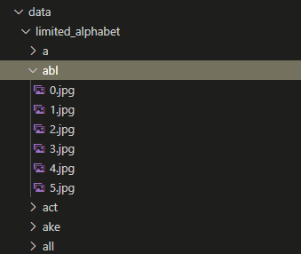

# Siamese Network framework

## fasi preliminari
installare versione dell'ambiente 

# Le diverse cartelle
## data
La cartella `data` contiene i dati per i diversi dataset.
in questa cartella si possono inserire delle cartelle per ogni alfabeto che si desidera utilizzare.
Un alfabeto non è altro che l'insieme di tutti i simboli di base per lo spotting
(Nel caso di N-grammi, un alfabeto è composto da tutti i possibili N-grammi presenti)

Ogni cartella di un alfabeto è composta da sottocartelle, una per ogni simbolo dell'alfabeto.
Ogni caretella simbolo contiene le immagini di esemplari appartenenti a quel simbolo.

Potrebbe essere comodo creare due diversi insiemi, uno per il training e uno per il test. In questo caso conviene creare due cartelle differentei coneneti ognuma gli elementi 

## dataset
La caretlla `dataset` è un package pyton che contiene tutti i moduli per gestire i dataset.

## modules
La caretlla `modules` è un package pyton che contiene tutti i moduli per gestire la rete siamese.

il package contiene il modulo `networks.py`  che fornisci diverse strutture di reti
all'interno di questo modulo ho implementatlo la classe `FrozenPHOCnet` che è uguale a quella della quale abbiamo discusso
In pratica la rete è composta da una PHOCnet congelata e da due livelli fully connected trainabili.
L'uscita della rete è un tensore di 256 elementi

il package contiene il modulo `trainer.py` gestisce l'addestramento di una rete Siamese.

## weights 
Nella cartella `weights` vengono salvati i pesi delle reti a valle della fase di addestramenti 

## train_PHOCnet.py
...

## test_PHOCnet
Questo file contiene un po' di esempi dell'utilizzo della rete e di come calcolare le distanze tra due imamgini

## siamese_measurer.py
Questo modulo contiene la classe `SiameseMeasurer`. Questa classe permette di calcolare la distanza tra due immagini data un "braccio" di una rete siamese
(In effetti quando il sistema salva il modello della rete salva soltanto un braccio. In questo modo si può salvare spazio in memoria e ottimizzare il processo di calcolo delle distanza tra più elementi)

# Per lo Spotting
possiamo qui implementare un file `spotting_siamese.py` nel quale implementiamo un sistema che prende in input una linea di testo, e utilizzando la classe `SiameseMesaurer` fa lo spotting di ogni elemento dell'alfabeto...
